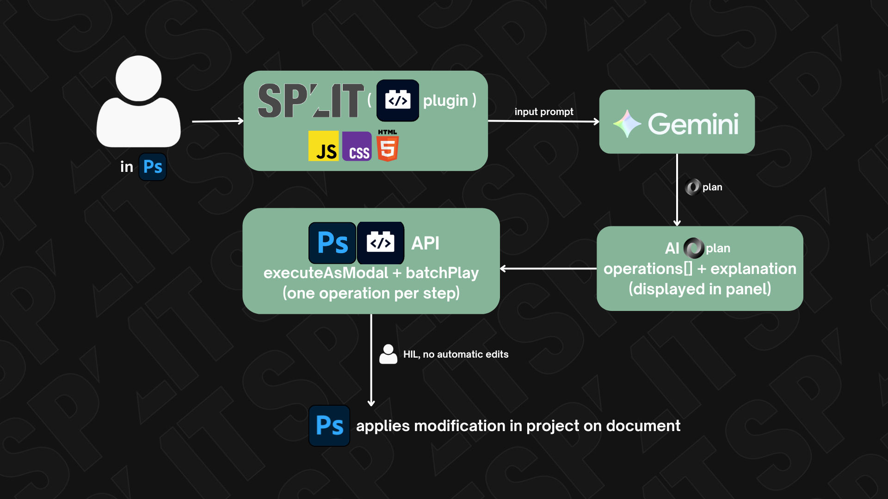

# Split: More Than Just a Plugin
### **The first practical AI integration for UXP** — proving that LLM-powered tools can coexist with transparency and user control.

**Split** is an Adobe Photoshop UXP plugin that translates natural-language instructions into structured, deterministic editing operations via Google Gemini.


**Built for:** Adobe Innovate4AI Hackathon  
**Team:** Alexandru Toboșaru, Matei Sandu, Cyrus Sepahpour  
**Stack:** Adobe UXP | Vanilla JavaScript | Google Gemini API

---

## Why It Matters

Most AI-powered creative tools present a false choice:
- **Fully automatic** = no transparency, no control
- **Disconnected** = manual workflows, no integration

Split bridges this gap: **AI intent → human approval → deterministic execution**

---

## Architecture

### Visual Overview


### Pipeline
```
Natural Language
    ↓
[Gemini] (structured prompt with JSON schema)
    ↓
JSON Editing Plan { operations: [...] }
    ↓
[User Review] (inspect + approve)
    ↓
[Validator] (type check, bounds check, safe execution)
    ↓
Photoshop batchPlay
```

### Core Components

| Layer | Tech | Responsibility |
|-------|------|-----------------|
| **Plugin** | Adobe UXP | Context gathering, `batchPlay` dispatch |
| **Reasoning** | Gemini API | Generate schema-compliant JSON plans |
| **Validation** | Vanilla JS | Enforce schema integrity + safe bounds |
| **UI** | HTML/CSS/JS | Review interface, no framework bloat |

---

## Supported Operations

### AI-Driven (via Gemini)
- **Resize** — Scale canvas & content with interpolation choice
- **Crop** — Intelligent crop with position (center, top, bottom, left, right)
- **Blur** — Gaussian, motion (with angle), radial (parameterized radius)
- **Color** — Brightness, contrast, saturation, temperature adjustments
- **Sharpness** — Unsharp mask with configurable amount, radius, and threshold

### Layer Operations
- **Merge Layers** — Concatenate multiple layers by name into a single layer
- **Select Subject** — Intelligent subject detection and separation using auto-cutout
- **Layer Selection** — Select specific layers by index or name


---

## Key Technical Decisions

✓ **Schema-First Design** — Gemini forced into strict JSON contract  
✓ **No Auto-Execute** — User approval required; modality enforced via `executeAsModal`  
✓ **Reversible** — All ops use Photoshop's native `batchPlay` descriptors  
✓ **Zero Framework** — Plugin UI is vanilla HTML/JS (UXP sandbox constraints)  
✓ **Context-Aware** — Document metadata fed to Gemini (DPI, layer count, bounds)  

---

## How to Use

### Setup
```sh
# 1. Install UXP Developer Tool (Adobe official)
# 2. In UDT, click "Add Plugin" → select manifest.json from plugin-uxp/

# 3. Load the plugin
uxp plugin load

# 4. Photoshop will open the plugin panel automatically
```

### Configuration
Set your Gemini API key in `modules/config.js`:
```javascript
const GEMINI_API_KEY = "your_api_key_here";
```

For production, use environment variables or a secure backend (see Roadmap).

### Dev Workflow
```sh
# Auto-reload on file changes
sh watch.sh
```

### Flow
1. Write natural-language instruction in the panel text area
   - Example: _"Rotate to portrait, brighten by 20%, add gaussian blur"_
2. Click **"Analyze & Apply"** → plugin queries Gemini
3. Review the JSON plan in the response section
4. Click **"Execute Changes"** to apply
5. Or use **Manual Controls** for direct adjustments (resize, crop, blur, color)
6. All changes are undoable via Photoshop's undo stack

---

## Core Files Breakdown

### `index.html` — Panel UI
- Text area for natural-language prompts
- AI Response section (shows JSON plan before execution)
- Manual Controls: collapsible sections for each operation type
- Sliders for numeric parameters (blur radius, brightness, contrast, etc.)
- Status messages (success/error feedback)

### `index.js` — Plugin Entry Point
- Initializes plugin via `modules/ui.js`
- Minimal setup; delegates to modular architecture

### `modules/` — Core Modules
- **`ai.js`** — Gemini integration, prompt execution, schema validation
- **`ui.js`** — Panel initialization, UI state management, event listeners
- **`operations.js`** — All editing operations (resize, crop, blur, color correction)
- **`layers.js`** — Layer manipulation and analysis
- **`document.js`** — Document context extraction (metadata, bounds)
- **`prompts.js`** — Gemini system/user prompt templates
- **`config.js`** — Configuration constants (API keys, schemas, bounds)
- **`utils.js`** — Helper functions (validation, error handling)

**Key pattern:** All operations wrapped in `executeAsModal()` to prevent conflicts.

### `manifest.json` — Configuration
- **Host:** Photoshop 24.0+
- **Permissions:** Network access to `generativelanguage.googleapis.com`
- **Panel:** 280-800px width, 400-1200px height
- **Type:** Floating/docked panel

### `style.css` — Dark UI Theme
- Glassmorphic design (backdrop blur, transparency)
- Color-coded sections (blue for AI, green for execute)
- Custom scrollbars, sliders, and buttons
- Responsive to panel resize

---

### Known Limitations & Future Work

### Current State
- **API key configuration** in `modules/config.js` (use environment variables for production)
- **Operations** — Covers core types (resize, crop, blur, color) with room for expansion
- **No undo/redo integration** — Uses Photoshop's native undo (works but not custom stack)
- **Document context** — Basic metadata; layer analysis available in `layers.js`

### Roadmap
- [ ] **Speech-to-Text** — Voice input for natural language instructions
- [ ] **Memory Bank** — Store and recall editing workflows for quick reuse
- [ ] **Multi-Agent System** — Coordinate multiple AI agents for complex tasks (e.g., one agent for composition, one for color, one for enhancement)
- [ ] Expand operation registry (new editing types)
- [ ] Backend proxy server for API security
- [ ] Batch processing (process multiple files)
- [ ] Advanced constraints (e.g., brand guidelines, style preservation)
- [ ] Performance: cache Gemini schemas to reduce API calls

---

## Challenges & Solutions

| Challenge | Solution |
|-----------|----------|
| Gemini hallucinating invalid operations | Strict JSON schema + type validation |
| Modal execution blocking UI | `executeAsModal` wrapper with promise chaining |
| Large document context | Only pass key metadata (dims, name, not layers) |
| Parameter bounds safety | Min/max validation before `batchPlay` |
| UXP sandbox limitations | Vanilla JS (no npm packages, no frameworks) |

---

## Repository Structure

```
split-ai/
├── index.html                 # UI: AI prompt + manual controls
├── index.js                   # Plugin entry point
├── manifest.json              # Plugin config (PS 24+, permissions, panel size)
├── package.json               # Package metadata
├── style.css                  # Dark theme UI (glassmorphic)
├── watch.sh                   # Dev: auto-reload script
├── LICENSE                    # Apache 2.0
├── README.md                  # This file
├── architecture.png           # Architecture diagram
├── icons/                     # Plugin icons
├── modules/                   # Modular architecture
│   ├── ai.js                  # Gemini API integration, schema validation
│   ├── ui.js                  # Panel initialization, event handling
│   ├── operations.js          # All editing operations (resize, crop, blur, color)
│   ├── layers.js              # Layer manipulation
│   ├── document.js            # Document context extraction
│   ├── prompts.js             # Gemini prompt templates
│   ├── config.js              # Config constants, API keys, schemas
│   └── utils.js               # Helper utilities
```

---

---

## License

This project is licensed under the **Apache License 2.0** — see the [LICENSE](./LICENSE) file for details.

---

## Acknowledgments

Built during **Adobe Innovate4AI Hackathon** in 48 hours in Bucharest. Special thanks to the **Bucharest event team** for hosting, mentorship, and valuable insights that shaped the direction of this project.